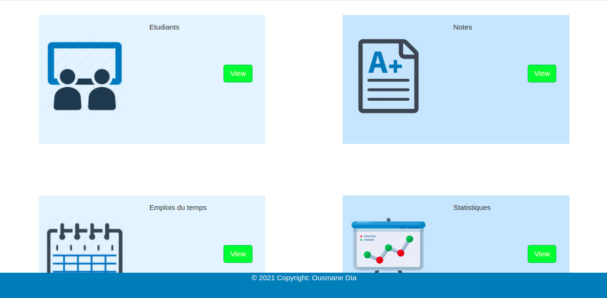
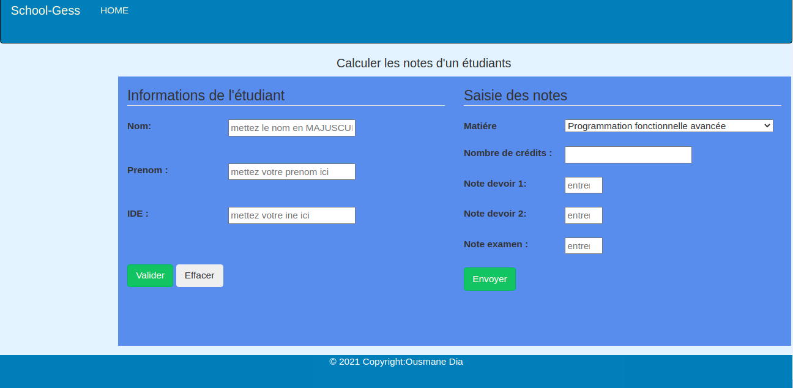
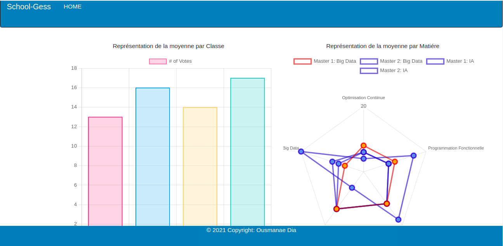

# ScalaWepp and Play Framework
Lecture:
Télècharger le dossier;
ouvrir avec votre "cmd".
cd "chemin d'accés">sbt>run et
Ouvrir le http://localhost:9000/ 
Description 
Dans un établissement scolaire, nous voulons créer une application qui permettra de faire la gestion de l'emploi du temps des cours et des notes des étudiants. Nous avons les entités suivants :

Professeur(idProfesseur, nomProfesseur, prenomPro, grade)
Etudiant(idEtudiant, nomEtudiant, prenomEtudiant, niveauEtude)
Salle(numeroSalle, libelleSalle)
Matiere(codeMatiere, libelleMatiere, coeffMatiere)

Règles :
Un cours ne peut être effectué que dans une salle avec un professeur à une date donnée. Un étudiant ne peut pas être présent en même temps dans deux cours différents. Un professeur enseigne une seule matière. Un étudiant peut suivre plusieurs matières. Pour valider une matière, l'étudiant doit avoir la moyenne de 10 sur la notes de ses deux devoirs plus sa note d'examen. La moyenne se calcule par la relation suivante :
[(𝑑𝑒𝑣𝑜𝑖𝑟1+𝑑𝑒𝑣𝑜𝑖𝑟2)/2+𝑒𝑥𝑎𝑚𝑒𝑛]/2
 
Attentes :
Vous devez fournir une application conviviale qui doit permettre :

de faire l'allocation des salles en fonction de l'emploi du temps.
de déterminer les salles disponibles entre un intervalle de temps de la journée
de trouver les salles occupées en précisant le nom du cours et le professeur
de lister les notes d'un étudiant
de calculer la moyenne de chaque étudiant
d'afficher les statistiques de l'établissement (moyenne de chaque classe, moyenne de chaque matière, le taux de réussites et d'échecs, etc.)

